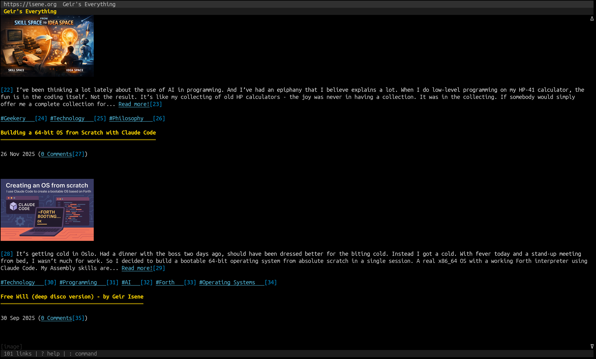

# brrowser



**The terminal web browser with vim-style keys.**

 [](https://badge.fury.io/rb/brrowser)   

A terminal web browser combining w3m-style rendering with qutebrowser-style keyboard navigation. Renders HTML with styled headings, links, tables, forms, and inline images. No modes, no mouse, just keys.



## Features

**Browsing:**
- Full HTML rendering (headings, paragraphs, lists, tables, blockquotes, code blocks, forms)
- Inline image display via [termpix](https://github.com/isene/termpix) (kitty/sixel/w3m protocols)
- ASCII art fallback via [chafa](https://hpjansson.org/chafa/) for non-graphical terminals
- YouTube embed detection with thumbnails and direct video links
- Back/forward history per tab
- Search engines (Google, DuckDuckGo, Wikipedia)
- Ad blocking via StevenBlack hosts list

**Navigation:**
- `j`/`k` or arrows to scroll, `gg`/`G` for top/bottom
- `TAB`/`S-TAB` to cycle through links and form fields (highlighted with reverse video)
- `Enter` to follow focused link or edit focused field
- `o` to open URL, `t` to open in new tab, `O` to edit current URL
- `H`/`Backspace` for back, `L` for forward
- `/` to search page, `n`/`N` for next/previous match

**Tabs:**
- `J`/`Right` next tab, `K`/`Left` previous tab
- `d` close tab, `u` restore closed tab

**Bookmarks and quickmarks:**
- `b` bookmark page, `B` show bookmarks
- `m` + `0-9` set quickmark, `'` + `0-9` go to quickmark

**Forms and passwords:**
- `f` to fill and submit forms with auto-fill from stored passwords
- Prompts to save new passwords after first login (Firefox-style)
- `p` to show stored credentials, `:password` to save manually
- `Ctrl-g` to edit a form field in `$EDITOR`

**Clipboard:**
- `y` copy page URL
- `Y` copy focused link URL or field value

**Images:**
- Inline display in reserved space (no text overlap)
- Images follow content during scrolling
- `i` to toggle images on/off
- Standalone image pages display full-screen
- Image mode configurable: auto, termpix, ascii, off

**AI and editing:**
- `I` to get an AI summary of the page (OpenAI, shown in scrollable popup)
- `e` to edit page source in `$EDITOR` and re-render
- `Ctrl-l` to force redraw

**Other:**
- `:download URL` to save files to ~/Downloads
- Binary files prompt: open with `xdg-open`, download, or cancel
- `P` for preferences popup (image mode, colors, homepage, search engine)
- `?` for built-in help page
- Cookie persistence across sessions
- Configurable colors for all UI elements

## Installation

```
gem install brrowser
```

### Dependencies

- Ruby 3.0+
- [rcurses](https://github.com/isene/rcurses) (terminal UI)
- [nokogiri](https://nokogiri.org/) (HTML parsing)
- [termpix](https://github.com/isene/termpix) (image display, optional)

Optional:
- [chafa](https://hpjansson.org/chafa/) for ASCII art images on non-graphical terminals
- ImageMagick (`convert`) for image scaling and SVG conversion
- `xclip`/`xsel`/`wl-copy` for clipboard support

## Usage

```bash
brrowser                        # Open blank page
brrowser https://example.com    # Open URL directly
brrowser isene.org              # Auto-adds https://
```

## Keybindings

| Key | Action |
|-----|--------|
| `j` / `k` / arrows | Scroll up/down |
| `Left` / `Right` | Previous/next tab |
| `gg` / `G` | Top / bottom of page |
| `Ctrl-d` / `Ctrl-u` | Half page down/up |
| `Space` / `PgDn` / `PgUp` | Page down/up |
| `TAB` / `S-TAB` | Next/previous link or field |
| `Enter` | Follow link or edit field |
| `o` / `O` | Open URL / edit current URL |
| `t` | Open URL in new tab |
| `H` / `Backspace` | Go back |
| `L` | Go forward |
| `r` | Reload page |
| `d` | Close tab |
| `u` | Undo close tab |
| `/` | Search page |
| `n` / `N` | Next/previous search match |
| `b` / `B` | Bookmark / show bookmarks |
| `m` + `0-9` | Set quickmark |
| `'` + `0-9` | Go to quickmark |
| `f` | Fill and submit form |
| `y` / `Y` | Copy URL / copy focused element |
| `e` | Edit page source in $EDITOR |
| `Ctrl-g` | Edit field in $EDITOR |
| `i` | Toggle images |
| `I` | AI page summary |
| `p` | Show stored password |
| `P` | Preferences |
| `Ctrl-l` | Redraw screen |
| `?` | Help |
| `q` | Quit |

## Commands

Type `:` to enter command mode.

| Command | Action |
|---------|--------|
| `:open URL` / `:o` | Navigate |
| `:tabopen URL` / `:to` | Open in new tab |
| `:close` / `:q` | Close tab |
| `:quit` / `:qa` | Quit |
| `:back` / `:forward` | History navigation |
| `:bookmark` / `:bm` | Add bookmark or open by name |
| `:bookmarks` / `:bms` | List bookmarks |
| `:download URL` / `:dl` | Download file |
| `:adblock` | Update ad blocklist |
| `:password` / `:pw` | Save password for current site |
| `:about` | Open project page |

## Configuration

Settings are stored in `~/.brrowser/config.yml`. Press `P` in the browser to open the preferences popup where you can change:

- Image mode (auto/termpix/ascii/off)
- Homepage and default search engine
- Colors for all UI elements (info bar, tab bar, content, status bar, links, headings)

Other data files in `~/.brrowser/`:
- `bookmarks.yml` - saved bookmarks
- `quickmarks.yml` - quickmark shortcuts
- `passwords.yml` - stored credentials (chmod 600)
- `cookies.yml` - persistent cookies
- `adblock.txt` - blocked domains list

## License

[Unlicense](https://unlicense.org/) - public domain.

## Credits

Created by Geir Isene (https://isene.org) with extensive pair-programming with Claude Code.
